# Automation Flowchart

This diagram shows the full execution flow of the upgrade automation, including the DryRun path, the happy path, the 8-cycle verification chain, cumulative-update patching, rollback, and failure cleanup paths.

```mermaid
flowchart TD
    Start([Start: Windows-2016-to-2022-Upgrade]) --> DryRunBranch{BranchOnDryRun}

    DryRunBranch -->|DryRun=true| PreCheckOnly[RunPreflightChecksDryRun<br/>run PreCheck document, no changes]
    PreCheckOnly --> EndDryRun([End: DryRun complete])

    DryRunBranch -->|DryRun=false| EnsureAccess[EnsureSsmAccess<br/>use existing SSM instance profile, attach temp profile if none, or fail if profile lacks SSM]
    EnsureAccess --> Preflight[RunPreflightChecks]
    Preflight --> Backup[CreateBackupImage<br/>AMI + reboot]
    Backup --> WaitAMI[WaitForBackupAMI]
    WaitAMI --> Deprecate[TagBackupImage + DeprecateBackupImage<br/>set retention date]
    Deprecate --> WaitReboot[WaitForInstanceAfterReboot<br/>poll SSM offline then online]
    WaitReboot --> UpdateAgent[UpdateSSMAgent]
    UpdateAgent --> DiskCheck[CheckDiskSpaceAndExpand]
    DiskCheck --> DiskBranch{BranchOnDiskExpansion}
    DiskBranch -->|expand needed| ExpandVol[ExpandRootVolume<br/>+ ExtendPartitionDiskpart]
    DiskBranch -->|enough space| FindMedia
    ExpandVol --> FindMedia[FindWindows2022Snapshot<br/>detect OS language]
    FindMedia --> CreateVol[CreateUpgradeVolume<br/>GP3 from 2022 media snapshot]
    CreateVol --> Drivers[Install drivers<br/>ENA, PV, NVMe]
    Drivers --> EC2Launch[MigrateToEC2Launchv2<br/>pre-upgrade: v2 supports Server 2016]
    EC2Launch --> AttachVol[AttachUpgradeVolume]
    AttachVol --> MountVol[InitializeAndMountVolume<br/>verify setup.exe]
    MountVol --> Upgrade[PerformUpgrade<br/>setup.exe /auto upgrade]
    Upgrade --> InitWait[InitialUpgradeWait<br/>aws:sleep PT10M]
    InitWait --> VerifyLoop{{Verification chain<br/>VerifyUpgrade1..8<br/>10-min sleep between cycles<br/>each executeScript &lt; 480s}}

    VerifyLoop -->|UPGRADE_COMPLETE<br/>OS = 2022, build 20348| CleanupVol[CleanupUpgradeVolume]
    VerifyLoop -->|FATAL<br/>IMAGE_STATE_UNDEPLOYABLE| RollbackBranch
    VerifyLoop -->|still incomplete<br/>after cycle 8| RollbackBranch

    CleanupVol --> CUBranch{BranchOnInstallCU}
    CUBranch -->|false| RemoveRecovery
    CUBranch -->|true| InstallCU[InstallPinnedUpdates<br/>OS SSU+LCU + .NET LCU via DISM<br/>best-effort: onFailure Continue]
    InstallCU --> RebootCU[RebootAfterUpdates] --> WaitCU[WaitForInstanceAfterUpdates]
    WaitCU --> VerifyCU[VerifyPatchLevel<br/>OS CU installed, activity-aware]
    VerifyCU --> RemoveRecovery[RemoveRecoveryPartition<br/>reclaim space]
    RemoveRecovery --> RestoreRole[RemoveTempProfile<br/>onFailure: Abort]
    RestoreRole --> Notify[SendSuccessNotification]
    Notify --> EndSuccess([End: SUCCESS])

    RollbackBranch{BranchOnAutoRollback}
    RollbackBranch -->|AutoRollback=true| RbCleanup[RollbackCleanupUpgradeVolume]
    RbCleanup --> RbSnapshot[RollbackGetBackupSnapshot<br/>+ RollbackWaitForSnapshot]
    RbSnapshot --> RbReplace[RollbackReplaceRootVolume<br/>restore pre-upgrade root + wait]
    RbReplace --> RbRestoreRole[RollbackRemoveTempProfile<br/>onFailure: Abort]
    RbRestoreRole --> RbNotify[RollbackSendNotification]
    RbNotify --> EndRollback([End: ROLLED BACK])

    RollbackBranch -->|AutoRollback=false| FailCleanup[FailCleanupUpgradeVolume]
    FailCleanup --> FailRestoreRole[FailRemoveTempProfile<br/>onFailure: Abort]
    FailRestoreRole --> FailEnd[FailWithoutRollback<br/>raise error]
    FailEnd --> EndFail([End: FAILED])

    %% --- Failure cleanup paths (best-effort, then fail loud) ---
    Preflight -. on failure .-> CleanupTPOF["CleanupTempProfileOnFailure<br/>remove temp profile if attached, then fail loud"]
    CleanupTPOF --> EndFail
    AttachVol -. on failure .-> FailCleanup
```

## Reading the Diagram

| Path | Description |
|------|-------------|
| **DryRun=true** | Runs pre-flight checks only, never modifies the instance |
| **Happy path** (solid lines down) | Full upgrade: backup → drivers → EC2Launch v2 → upgrade → verify → patch → cleanup |
| **Verification chain** | `InitialUpgradeWait` then up to 8 `VerifyUpgradeN` cycles with a 10-minute `aws:sleep` between each (~90-minute window) |
| **Rollback path** (AutoRollback=true) | On upgrade failure: restore root volume from the backup AMI snapshot via Replace Root Volume |
| **Failure path** (AutoRollback=false) | On upgrade failure: clean up volumes and profiles, then fail loud for investigation |
| **Dotted lines** | Failure cleanup shortcuts — any step that fails routes to the appropriate cleanup path |

### Why the verification chain is unrolled into 8 cycles

A single long-polling `aws:executeScript` step cannot wait for the upgrade to finish: the `aws:executeScript` handler is **hard-capped at 600 seconds**, regardless of the step's `timeoutSeconds`. A single step set to wait ~90 minutes is killed at the 10-minute mark while the OS is still mid-upgrade.

The chain works around this:

- **`InitialUpgradeWait`** — `aws:sleep PT10M` (the `aws:sleep` action has no 600s cap).
- **`VerifyUpgrade1` .. `VerifyUpgrade8`** — each an `aws:executeScript` with `timeoutSeconds` under 480s, safely inside the 600s cap.
- **`Sleep1` .. `Sleep7`** — `aws:sleep PT10M` between verify cycles.
- Each `VerifyUpgradeN` classifies the instance: **UPGRADE_COMPLETE** branches to `CleanupUpgradeVolume`; **FATAL** (`IMAGE_STATE_UNDEPLOYABLE`) raises immediately and routes to rollback; **in-progress** falls through to the next sleep. Cycle 8 raises if the upgrade still has not completed.

Total window: roughly 90 minutes (1 initial + 7 inter-cycle sleeps of 10 minutes each, plus verify time).

### Key Design Principles

- **No orphaned resources:** Every path (success, failure, rollback) cleans up the upgrade EBS volume and removes any temporary instance profile the automation attached.
- **Patching is best-effort:** The `InstallPinnedUpdates` → `VerifyPatchLevel` segment uses `onFailure: Continue`. A patch failure never aborts the run — the OS upgrade already succeeded.
- **Temp profile always removed:** The `RemoveTempProfile` step uses `onFailure: Abort` — if profile removal itself fails (rare: throttling, transient API error), the automation halts loudly so you know to clean up manually.
- **Existing instance profiles are never modified:** If the instance already has an instance profile (with or without SSM permissions), the automation either uses it or fails with guidance — it never attaches/detaches the instance's own profile.
- **EC2Launch v2 runs pre-upgrade:** v2 supports Server 2016, so migrating before the upgrade carries the agent cleanly into 2022.
